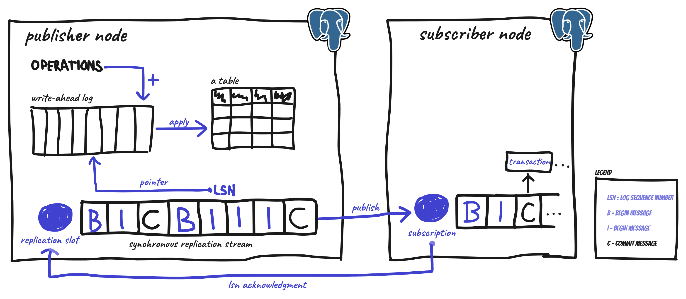

 

# How does it work?

Simple! 😌

## TL;DR

- Hermes PostgreSQL is implementation of the **Outbox pattern** in **NodeJS**/**TypeScript** environment.

- **Save data in the database and publish messages in one reliable logical unit. You won't loose anything.**

- God Hermes finds a love interest in [Postgres.js](https://github.com/porsager/postgres) which is its tool for talking to PostgreSQL and to manage the connection pool. You can also pass your own connection.

- Hermes PostgreSQL follows the "**Log First!**" paradigm by working on the database's **Write-Ahead Log** (WAL).

- Hermes relies on the PostgreSQL's [Logical Replication](https://www.postgresql.org/docs/current/logical-replication.html).

- Hermes PostgreSQL provides own implementation of the Logical Replication protocol, so it is **optimized for its needs**.

- This approach enables Hermes to receive information about things that come to the Outbox table. **No long-polling**. Fast and reliable **publisher-subscriber** connection to PostgreSQL.

## What is WAL and Logical Replication?

Shortly, the Logical Replication is a way of representing the **Write-Ahead Log** (WAL) of PostgreSQL. So, it is not a sequence of raw bytes, but rather a sequence of logical actions, like _Transaction Begin_, _Insert_, _Update_, _Delete_, _Commit_.

See how the WAL ensures **atomicity** and **durability** 👇

Now see how the Logical Replication feature work on this diagram 👇

➡️ Logical Replication is a mode of how the WAL decodes data — we can read WAL data as logical operations constituting the following transactions

➡️ PostgreSQL gives us an option to create Replication Slots, which are part of the publishing side

➡️ A Replication Slot contains a pointer to the WAL

➡️ Each operation in the Replication Slot has a Log Sequence Number (LSN) that uniquely points to a position in the WAL

➡️ Actually, there is more than one LSN.

➡️ Restart LSN represent the earliest message a subscriber needs while repeating the lost connection

➡️ Confirmed Flush LSN, on the other hand, is the last confirmed number by a subscriber

➡️ Confirmed Flush LSN may be in the middle of a transaction, so in case of repeating the stream, the Replication Slot has to start from Restart LSN to keep consistency of transactional data

➡️ The gap between the two LSNs represents the WAL that must be retained

➡️ A subscriber gets the following logical transactional messages

➡️ A subscriber must acknowledge the LSN it successfully processed

## Internal implementation

Look at the diagram below to track down how things work internally in Hermes PostgreSQL 👇

➡️ The app sends messages (events, commands) to Hermes PostgreSQL

➡️ Hermes PostgreSQL stores these messages in a special residental database structure, in a dedicated Outbox table

➡️ Messages are ordered with the autoincremented primary key

➡️ All messages are logged in the PostgreSQL's WAL

➡️ So, far only the first message has been acknowledged. _Acknowledged by our subscriber. We assume there is only one subscriber for the sake of simplicity_

➡️ Logical Replication's mechanism of WAL publishes new messages to Hermes PostgreSQL, here called _Outbox Processor_

➡️ Hermes has an in-memory _internal qeueue_ that keeps incoming, not acknoledged messages

➡️ After receiving new messages, Hermes calls application callbacks for these messages, in appropriate order

➡️ Hermes waits for the application to process the second message before it acknowledges it to PostgreSQL's Logical Replication. Despite the fact, the callbacks for the thrid or fourth message can be finished first, Hermes cannot acknowledge them before the second message. Because in case of an outage, Logical Replication would resume on thrid/fourth message instead the second message

➡️ When the application callback is finished without an error, then it is considered as its corresponding message has been processed and Hermes can treat it as acknowledged
