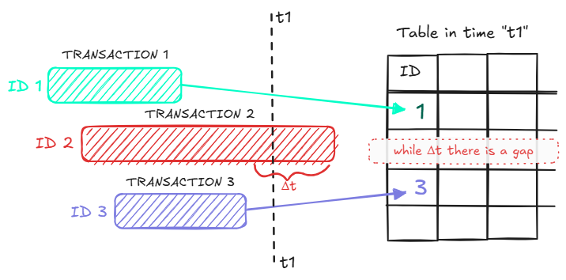

 

# Limitations

You are limited to [maximum number](https://www.postgresql.org/docs/current/runtime-config-replication.html#GUC-MAX-REPLICATION-SLOTS) of [replication slots](./how-does-it-work.md). The default is 10.

This is the setting per whole cluster.

## Explanation

If one replication slot is far behind the others, say 1000 messages behind, the database can’t safely release those messages because there is still a replication slot that will need this data.

Thus, the main pain point of the Logical Replication feature is the limitation of how many Replication Slots can exist at the same time on a cluster. By default, it’s 10. The limitation comes from the fact that the WAL has to be retained for the slowest subscriber.

As database administrators, we can increase this value as much as we want, considering we may exhaust the hard drive capacity. Also, many Replication Slots result in memory pressure from maintaining multiple decoder states (decoding WAL raw data into logical transactional messages).

As the Logical Replication is the foundation of the Hermes PostgreSQL, its limitations are also limitations of the library.

Also, the PostgreSQL team works hard on the following releases, and each new release brings some nice improvements in the future.

## How can we manage the limitation?

➡️ We can achieve scaling of message delivery by **partitioning** (each partition is a separate Replication Slot)

➡️ Although there are no performance tests yet, the Logical Replication is a native mechanism of PostgreSQL which is not implemented on the pull (like MongoDB Change Streams) but rather on the pub/sub mechanism, so it’s performant by design as it takes off the necessity of performing countless I/O requests to the database.

➡️ Taking that into account, one instance of your app should be able to process many messages at the same time

➡️ It all depends on your resources (CPU, memory, disk space), average message size and how fast the slots will progress (whether there will often be some bottlenecks). You can bump the maximum slots limit from 10 to 100 and be fine.

## Out of order delivery

Look at the picture below 👇

The auto-increment primary key's value is figured out before a transaction starts.
That is why it is possible that during the Δt, there will be only rows of identifiers one and three.
When transaction two is finished, the "gap" will be fulfilled.

Don't worry. Thanks to Logical Replication, Hermes will pull out the second message, but there is one consequence.

Hemres PostgreSQL will process transactions one and three, and later transaction two.

So, this will be done out of order.

At least so far.
